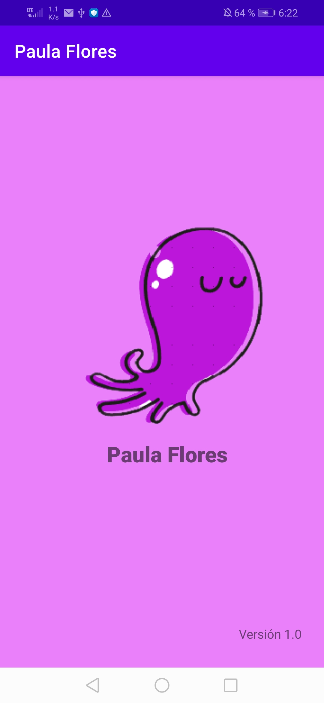
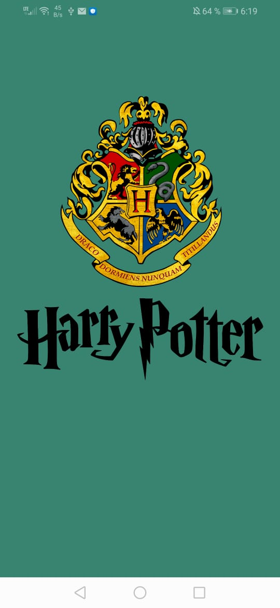
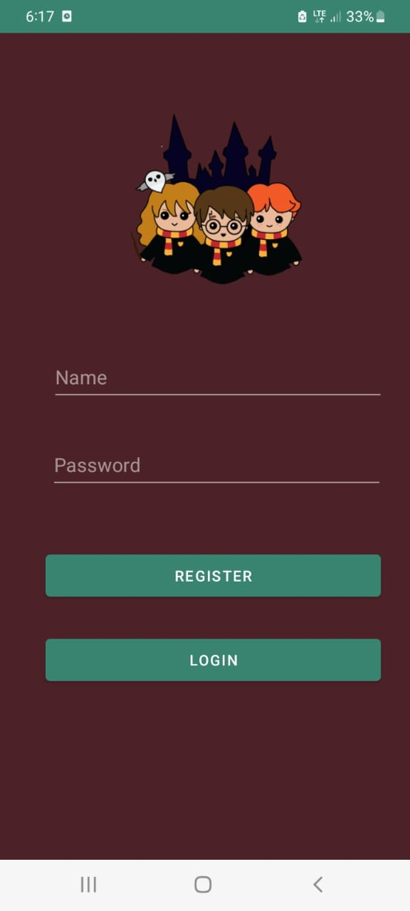
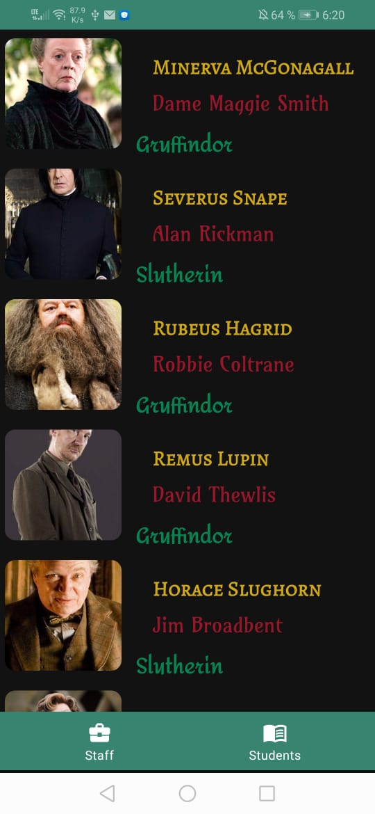
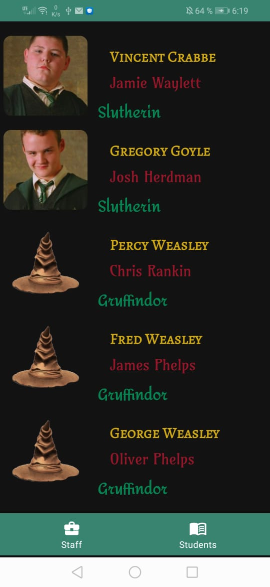
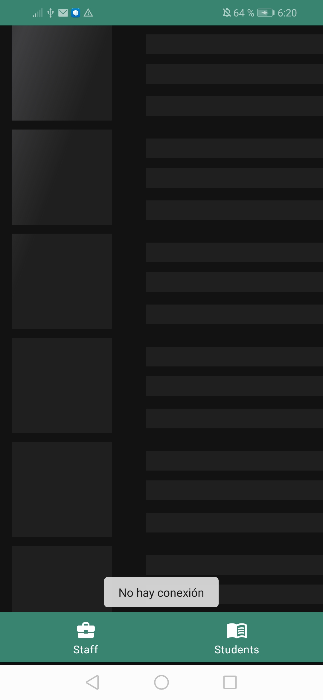

# EJ1 : Formulario con validaciones
En este formulario a partir de la fecha de nacimiento en un datePicker calcula la edad el signo zodiacal y el horoscopo chino.
Permite ingresar la carrera en un spinner y muestra las 3 imagenes como rsultado. 

  
  
  
  
  

# ejercicio2 : Harry Potter
Se usó el API de Harry Potter, recycleView , login con firebase , efecto shimmer para la conexión , los personajes con imagen null se muestran con un sombrero

    
  
    
    
    
    
    

